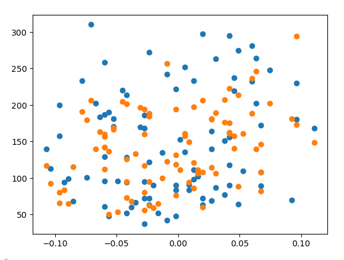
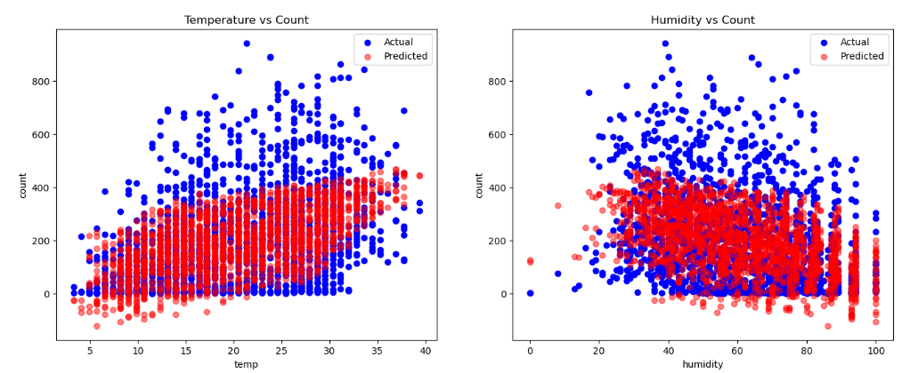
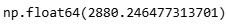
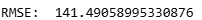
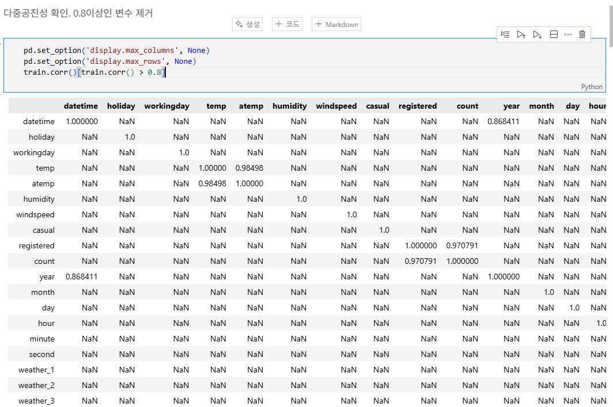
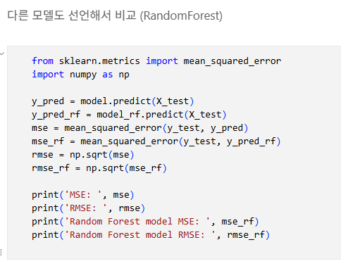
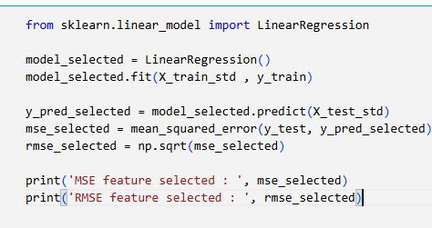

# AIFFEL Campus Online Code Peer Review Templete
- 코더 : 구재현
- 리뷰어 : 이상진


# PRT(Peer Review Template)
- [O]  **1. 주어진 문제를 해결하는 완성된 코드가 제출되었나요?**
        
        
        
        
    
- [O]  **2. 전체 코드에서 가장 핵심적이거나 가장 복잡하고 이해하기 어려운 부분에 작성된 
주석 또는 doc string을 보고 해당 코드가 잘 이해되었나요?**
        
        
- [O]  **3. 에러가 난 부분을 디버깅하여 문제를 해결한 기록을 남겼거나
새로운 시도 또는 추가 실험을 수행해봤나요?**
        
        
- [O]  **4. 회고를 잘 작성했나요?**
        

- [O]  **5. 코드가 간결하고 효율적인가요?**
        


# 회고(참고 링크 및 코드 개선)
```
# 새로운 실험이 체계적으로 잘 이루어 졌음 
# feature enginieering에 대한 기본적인 지식이 존재하는 것으로 보임
# 코드를 작성해본 경험이 있는 것으로 보아 PEP8의 기본적인 규칙을 벗어나지 않는 코드가 작성됨
# 
```
