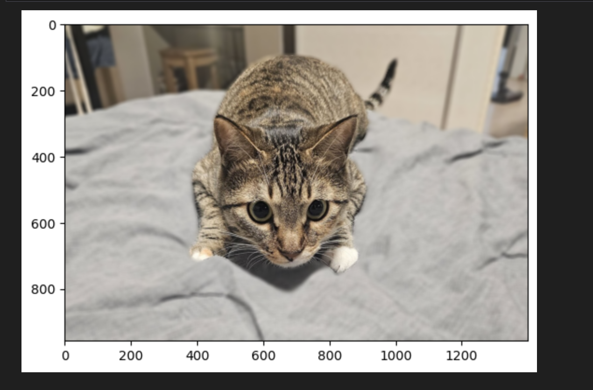
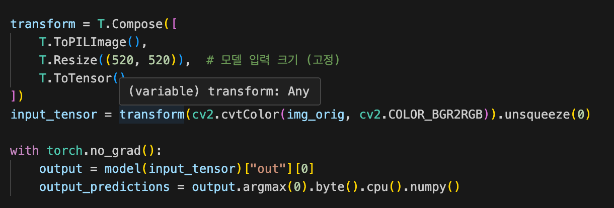

# AIFFEL Campus Online Code Peer Review Templete

- 코더 : 코더의 이름을 작성하세요.
- 리뷰어 : 리뷰어의 이름을 작성하세요.

# PRT(Peer Review Template)

- [ ▲	] **1. 주어진 문제를 해결하는 완성된 코드가 제출되었나요?**
  - 문제에서 요구하는 최종 결과물이 첨부되었는지 확인
    - 중요! 해당 조건을 만족하는 부분을 캡쳐해 근거로 첨부

      (1) 동물 세그멘테이션
      


      (2) 인물 세그멘테이션
      코드 오류로 인해 완료되지 않은 것으로 보입니다.

      (3) 인물 크로마키
      


  
- [ O ] **2. 전체 코드에서 가장 핵심적이거나 가장 복잡하고 이해하기 어려운 부분에 작성된
      주석 또는 doc string을 보고 해당 코드가 잘 이해되었나요?** - 해당 코드 블럭을 왜 핵심적이라고 생각하는지 확인 - 해당 코드 블럭에 doc string/annotation이 달려 있는지 확인 - 해당 코드의 기능, 존재 이유, 작동 원리 등을 기술했는지 확인 - 주석을 보고 코드 이해가 잘 되었는지 확인 - 중요! 잘 작성되었다고 생각되는 부분을 캡쳐해 근거로 첨부

      주석이 적절하게 제시되어 있습니다.
      "# 모델에서 출력된 세그멘테이션 마스크를 확인합니다."
      "# 마스크는 유지하되 배경은 블러처리를 한 이후 concat하여서 고양이에 집중된 사진을 만듭니다." 등


- [ O ] **3. 에러가 난 부분을 디버깅하여 문제를 해결한 기록을 남겼거나
      새로운 시도 또는 추가 실험을 수행해봤나요?** - 문제 원인 및 해결 과정을 잘 기록하였는지 확인 - 프로젝트 평가 기준에 더해 추가적으로 수행한 나만의 시도,
      실험이 기록되어 있는지 확인 - 중요! 잘 작성되었다고 생각되는 부분을 캡쳐해 근거로 첨부

      인물 세그멘테이션 관련 오류 해결중이었던 것으로 보입니다.

- [ X ] **4. 회고를 잘 작성했나요?**
  - 주어진 문제를 해결하는 완성된 코드 내지 프로젝트 결과물에 대해
    배운점과 아쉬운점, 느낀점 등이 기록되어 있는지 확인
  - 전체 코드 실행 플로우를 그래프로 그려서 이해를 돕고 있는지 확인
    - 중요! 잘 작성되었다고 생각되는 부분을 캡쳐해 근거로 첨부

    이번 프로젝트에서는 회고를 확인하지 못했습니다.


- [ ▲	] **5. 코드가 간결하고 효율적인가요?**
  - 파이썬 스타일 가이드 (PEP8) 를 준수하였는지 확인
  - 코드 중복을 최소화하고 범용적으로 사용할 수 있도록 함수화/모듈화했는지 확인
    - 중요! 잘 작성되었다고 생각되는 부분을 캡쳐해 근거로 첨부

코드는 매우 간결하고, 함수화와 모듈화 등이 적절히 적용되어 있습니다.
      

# 회고(참고 링크 및 코드 개선)

```
# 리뷰어의 회고를 작성합니다.
# 코드 리뷰 시 참고한 링크가 있다면 링크와 간략한 설명을 첨부합니다.
# 코드 리뷰를 통해 개선한 코드가 있다면 코드와 간략한 설명을 첨부합니다.
```
간결한 코드가 인상적이었습니다.
인물 세그멘테이션 부분에서 오류가 발생한 이유가 무엇인지 파악하시면 좋을 것 같습니다.